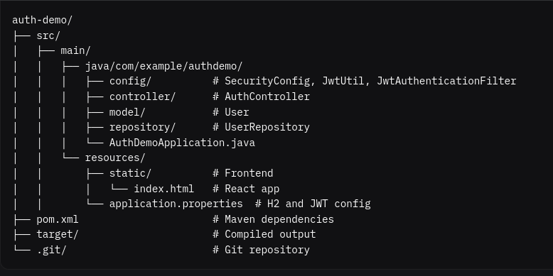

# Choices

## Why I chose this folder structure

I have used a standard directory structure which is created by default by spring initializer because frontend is going to be relatively simple SPA

## Why using H2 Database

H2 is a lightweight, open-source, in-memory and embedded relational database written in Java.

